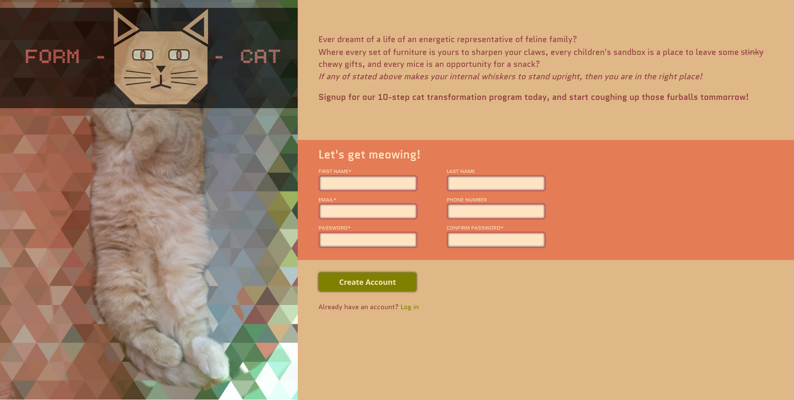

# Form-a-cat

A sign-up form for human to cat transformation program

## Preview

## Description

Form A Cat is a project that aims to show basic usage of HTML forms: their structure, styling and validation process.

Additionally to forms, project uses other new features that were present in the curriculum, such as: custom font usage, SVG's and their formatting, custom element positioning, advanced selectors, and custom CSS properties.

